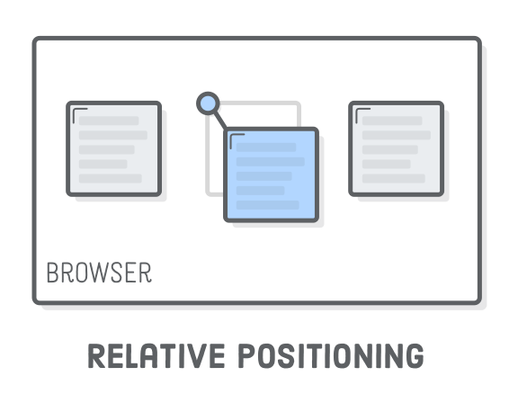
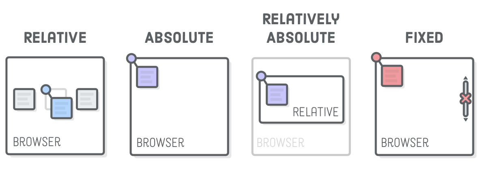

# Layout Schemes

4 types of positioning schemes exist in CSS.


# Static positioning

- “Static positioning”refers to the normal flow of the page. The Box Model, Floats and flexbox layout schemes all operate this static positioning

- The other three types of positioning are:
  - relative 
  - absolute
  - fixed

- Each of them let you manually position elements using specific coordinates.

# Relative Positioning

- “Relative positioning" moves elements around *relative* to where they would normally appear in the static flow of the page. 
- This is useful for nudging boxes around when the default flow is just a little bit off.

```css
.item-relative {
	position: relative;
	top: 30px;
	left: 30px;
}
```



- The `position: relative;` line makes it a positioned element, and the `top` and `left` properties let you define how far it's offset from its static position.
-  This is sort of like setting an (*x*, *y*) coordinate for the element.
- The `top` and `left` properties measure from the original box's top and left edges, respectively.
-  We can offset relative to the other edges with the `bottom` and `right` properties.

- Note that these properties accept negative values, which means there’s two ways to specify the same offset. We could just as easily used `top: -30px;` in place of the `bottom: 30px;` declaration above.

# Absolute positioning

- “Absolute positioning”is just like relative positioning, but the offset is relative to the entire browser window instead of the original position of the element. 
- It completely removes an element from the normal flow of the page. 
- This the most manual way to
-  lay out an element - since there's no longer any relationship 

```css
.item-absolute {
	position: absolute;
	top: 10px;
	left: 10px;
}
```


- Coordinates for absolute elements are always relative to the closest container that is a positioned element. 
- It only falls back to being relative to the browser when none of its ancestors are positioned.



# Fixed positioning

- Fixed elements don't scroll with the rest of the page
- The element is removed from the normal flow of the page
- The coordinate system is relative to the entire browser window

```css
.item-fixed {
  position: fixed;
  bottom: 0;
  right: 0;
}
```

- This lets you create navigation bars that always stay on the screen
- And those annoying pop-up banners that never go away!

