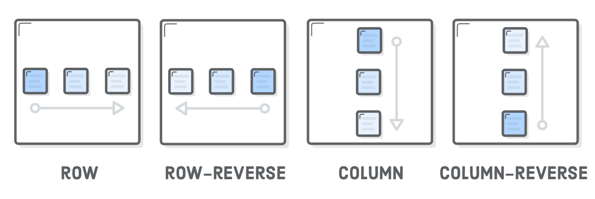

# Flexbox

- Flexbox gives us *complete* control over the 
  - alignment, 
  - direction, 
  - order, and 
  - size of our boxes.


- Flexbox uses two types of boxes
  - flex container
  - flex items
- The job of a flex container is to group a bunch of flex items together and define how they're positioned.
- Every HTML element that's a direct child of a flex container is an“item". 
- Flex items can be manipulated individually, but for the most part, it's up to the container to determine their layout. 
- The main purpose of flex items are to let their container know how many things it needs to position.
- Defining complex web pages with flexbox is all about nesting boxes.
-  You align a bunch of flex items inside a container, and, in turn, those items can serve as flex containers for their own items.

# Flex containers

- The first step in using flexbox is to turn one of our HTML elements into a flex container. We do this with the `display` property.
- By giving it a value of `flex`, we're telling the  browser that everything in the box should be rendered with flexbox instead of  the default box model.

# justify-content

-  Define the horizontal alignment of its items. 

```css
justify-content : center;
```

- This has the same effect as adding a `margin: 0 auto` declaration
- Other values for `justify-content` are :
  - `center`
  - `flex-start`
  - `flex-end`
  - `space-around`
  - `space-between`

# Grouping Flex items

- Flex containers only know how to position elements that are one level deep - their child elements
- They don't care one bit about what's inside their flex items
- Wrapping a bunch of items in an extra `<div>` results in a totally different web page.


# align-items

- Flex containers can also define the vertical alignment of their items. This is something not possible with floats.

```css
 align-items: center; 
```

The available options for `align-items` is similar to `justify-content`:

- `center`
- `flex-start`  (top)
- `flex-end`    (bottom)
- `stretch`
- `baseline`


# Grids

- Flexbox can render items as a grid.
- It can also change their alignment, direction, order, and size.
- To create a grid, we need the `flex-wrap` property.

```css
flex-wrap: wrap;
```


# Flex container direction

- “Direction" refers to whether a container renders its items horizontally or vertically

- The default rendering of containers is the horizontal direction

  - items are drawn one after another in the same row before popping down to the next column when they run out of space.

- One of the most amazing things about flexbox is its ability to transform rows into columns using only a single line of CSS. 


```css
flex-direction: column;
flex-direction: row;
```

- Flex-direction is useful for building responsive layouts.

- When you rotate the direction of a container, you also rotate the direction of the `justify-content` property. 

```css
flex-direction: column;
align-items: center;
```

# flex direction

- The `flex-direction` property also offers you control over the order in which items appear via the `row-reverse` and `column-reverse` properties. 



```css
flex-direction: row-reverse;
flex-direction: column-reverse;
```

# flex item order

- Adding an `order` property to a flex item defines its order in the container without affecting surrounding items. 
- Its default value is `0`, and increasing or decreasing it from there moves the item to the right or left, respectively.

- `order` works across row/column boundaries.

# flex item alignment

- We can align items individually

```css
.social,
.subscribe {
  align-self: flex-end;
  margin-bottom: 20px;
}
```

You can align elements in other ways using the same values as the `align-items` property, listed below for convenience.

- `center`
- `flex-start`  (top)
- `flex-end`    (bottom)
- `stretch`
- `baseline`

# Flex items

-  Flex items are *flexible*: they can shrink and stretch to match the width of their containers.
- The `flex` property defines the width of individual items in a flex container. 
- It works as a weight that tells the flex container how to distribute extra space to each item. 
- An item with a `flex` value of `2` will grow twice as fast as items with the default value of `1`.

# Summary

- Use `display: flex;` to create a flex container.
- Use `justify-content` to define the horizontal alignment of items.
- Use `align-items` to define the vertical alignment of  items.
- Use `flex-direction` if you need columns instead of rows.
- Use the `row-reverse` or `column-reverse` values to  flip item order.
- Use `order` to customize the order of individual elements.
- Use `align-self` to vertically align individual items.
- Use `flex` to create flexible boxes that can stretch and shrink.

