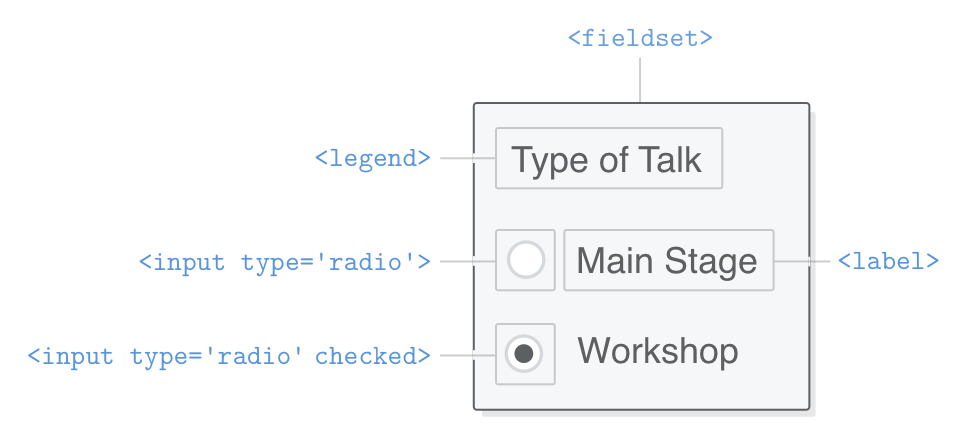

## HTML FORMS

- HTML form elements let you collect input from your website's visitors.
-  Mailing lists, contact forms, and blog post comments are common examples for small websites, but in organizations that rely on their website for revenue, forms are sacred and revered.
- Every HTML form begins with the aptly named `<form>` element. 
- It accepts a [number of attributes, but the most important ones are `action` and `method`.

```html
<form action='' method='get'>
</form>
```

- The `action` attribute defines the URL that processes the form.
- The `method` attribute can be either `post` or `get` both of which define how the form is submitted to the backend server.
- By leaving the `action` attribute blank, we're telling the form to submit to the same URL. Combined with the `get` method, this will let us inspect the contents of the form.

## Text input fields

- The `<input/>` element. 

```html
<label for='full-name'>Name</label>
<input id='full-name' name='full-name' type='text'/>
```

- we have a `<label>`, which you can think of as another semantic HTML element like `<article>` or `<figcaption>`. 
- A label's `for` attribute must match the `id` attribute of its associated `<input/>` element.
- An `<input/>` element represents a “variable” that gets sent to the backend server. The `name` attribute defines the name of this variable, and the value is whatever the user entered into the text field. 
- That you can pre-populate this value by adding a `value` attribute to an `<input/>` element.

## Email input fields

```html
<input id="full-name" 
       name="email"  
       type="email"
       placeholder="joe@example.com" />
```

## Radio Buttons

- Changing the `type` property of the `<input/>` element to `radio` transforms it into a radio button. 
- Radio buttons always operate in groups, allowing the user to choose one out of many predefined options.
- We need a label for each `<input/>` element
- We also need a way to group radio buttons and label the entire group
- This is accomplished with the `<fieldset>` and `<legend>` elements.

- Every radio button you create should:
  - Be wrapped in a `<fieldset>` which is labeled with a `<legend>`
  - Associate a `<label>` element with each radio button.
  - Use the same `name` attribute for each radio button in the group.
  - Use different `value` attributes for each radio button.

```html
<fieldset class='legacy-form-row'>
  <legend>Type of Talk</legend>
  <input id='talk-type-1'
         name='talk-type'
         type='radio'
         value='main-stage' />
  <label for='talk-type-1' class='radio-label'>Main Stage</label>
  <input id='talk-type-2'
         name='talk-type'
         type='radio'
         value='workshop'
         checked />
  <label for='talk-type-2' class='radio-label'>Workshop</label>
</fieldset>
```



- Unlike text fields, the user can't enter custom values into a radio button, which is why each one of them needs an explicit `value` attribute. 
- This is the value that will get sent to the server when the user submits the form. 
- It's also very important that each radio button has the same `name` attribute, otherwise the form wouldn't know they were part of the same group.
- The `checked` attribute of a radio button is a boolean attribute, meaning that it never takes a value—it either exists or doesn't exist on an `<input/>` element. If it does exist on either a radio button or a checkbox element, that element will be selected/checked by default.

## Select elements (dropdown menus)

Dropdown menus offer an alternative to radio buttons, as they let the user select one out of many options. The `<select>` element represents the dropdown menu, and it contains a bunch of `<option>` elements that represent each item.

Just like our radio button `<input/>` elements, we have `name` and `value` attributes that get passed to the backend server. But, instead of being defined on a single element, they're spread across the `<select>` and `<option>` elements.

```html
<div class='form-row'>
  <label for='t-shirt'>T-Shirt Size</label>
  <select id='t-shirt' name='t-shirt'>
    <option value='xs'>Extra Small</option>
    <option value='s'>Small</option>
    <option value='m'>Medium</option>
    <option value='l'>Large</option>
  </select>
</div>
```

n
