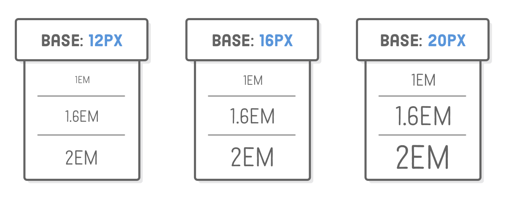

# Interneting is *not* hard 

## HTML Elements Types

There are 2 types of  major HTML elements:

1. `block-level` elements also know as `flow` elements.

   - `block level` elements are always drawn on a new line.

   ```html
   <p>, <h1>...</h1>, <ol>, <li>...</li>
   ```

2. `inline` elements known as `phrasing` elements.

   - `inline` elements can affect sections of text anywhere within a line.

   ```html
   <em>...</em> <!-- affects the span of a text inside a paragraph -->
   <strong>...</strong>
   ```

## Self Closing Elements

Some elements can be `empty` or `self-closing`. Line breaks and horizontal rules are the most common empty elements you’ll find.

```html
<br/> <!-- line break -->
<hr/> <!-- thematic break -->

```

## Links

Absolute, relative, and root-relative links refer to the value of the `href` attribute. Absolute links

### Absolute Links

`Absolute` links are the most detailed way you can refer to a web resource. They start with the “scheme” (typically `http://` or `https://`), followed by the domain name of the website, then the path of the target web page.

```html
<a href='https://developer.mozilla.org/en-US/docs/HTML'>Mozilla Developer Network
</a>
```

They are best used for directing users to a new website.

### Relative Links

`Relative` links point to another file in your website from the vantage point of the file you’re editing. It’s implied that the scheme and domain name are the same as the current page, so the only thing you need to supply is the path.

```html
<li> Relative links like to our <a href='misc/extras.html'>Extras page.</a> </li>
```

### Root-Relative Links

`Root-relative` links are similar to `relative` links but instead of being relative to the current page, they’re relative to the “root” of the entire website. 

```html
<a href="/">Home page</a>
```

## Images

### Image Formats

There are 4 main image formats in use on the web.

- JPG Images - `jpg`images are great for photos and images with lots of gradients in them. 
- GIF Images - `GIF`s are the go-to option for simple animations, but the trade off is that they’re somewhat limited in terms of color palette—never use them for photos.
- GIF Images - `GIF`s are the go-to option for simple animations.
- PNG Images - `PNG`s are great for anything that’s not a photo or animated. For photos, a `PNG` file of the same quality (as perceived the human eye) would generally be bigger than an equivalent `JPG` file. They are excellent fit for icons, technical diagrams, logos, etc.
- SVG Images  - a vector-based graphics format, meaning it can scale up or down to *any* dimension without loss of quality. This property makes `SVG` images a wonderful tool for responsive design. 

### Image Dimensions

- By default, the `` element uses the inherit dimensions of its image file. 
- The `width` attribute sets an explicit dimension for the image.
- Setting both `width` and `height` attributes will cause the image to scale proportionally, while defining both will stretch the image. 
- Dimension values are specified in pixels, and you should never include a unit (e.g., `width='75px'` would be incorrect).

## Reserved Characters

The `<`, `>`, and `&` characters are called “reserved characters” because they aren’t allowed to be inserted into an HTML document without being encoded. This is because they mean something in the HTML syntax: `<` begins a new tag, `>` ends a tag, `&` sets off an HTML entity. 

```html
<!-- There are three reserved characters in HTML: -->
&lt; &gt; &amp; 
<!-- You should always use HTML entities for these three characters, -->
```

Entities always begin with an ampersand (`&`) and end with a semicolon (`;`). In between, you put a special code that your browser will interpret as a symbol. In this case, it interprets `lt`, `gt`, and `amp` as less-than, greater-than, and ampersand symbols, respectively.

## CSS

### Units of Measurement

Many CSS properties require a unit of measurement. There are lots of unit measurement available, but the common are `px` pixel and `em` - pronounced like the letter _m_.

The `em` unit is very useful for defining sizes relative to some base font. it scales the measurement up or down to match the base font defined.




### Selecting multiple elements

We can select multiple HTML elements in the same CSS rule by separating them with commas. 

```css
h1, h2, h3, h4, h5, h6 {
  font-family: "Helvetica", "Arial", sans-serif;
}
```

### Defining Fonts

`font-family` is a CSS property that defines the typeface for whatever element you selected. It accepts multiple values because not all users will have the same fonts installed. 

```css
font-family: "Helvetica", "Arial", sans-serif;
```

### List Styles

The `list-style-type` property lets you alter the bullet icon used for `<li>` elements. You’ll typically want to define it on the parent `<ul>` or `<ol>` element:

```css
ul {
  list-style-type: circle;
}

ol {
  list-style-type: lower-roman;
}
```

### Underlines

The `text-decoration` property determines whether text is underlined or not. By setting it to `none`, we can remove the default underline from all of our links. 

```css
a {
  text-decoration: none;
}
```

### Font Weight and Styles

The `font-weight` property defines the “boldness” of the text in an element, and the `font-style` property indicates whether it’s italicized or not.

```css
h1, h2, h3, h4, h5, h6 {
  font-family: "Helvetica", "Arial", sans-serif;
  font-weight: normal;                              
}
```

### The Cascade

The “cascading” part of CSS is due to the fact that rules cascade down from multiple sources.

The CSS hierarchy for every web page is:

5. The browser’s default stylesheet

4. User-defined stylesheets

3. External stylesheets (that’s us)

2. Page-specific styles (that’s also us)

1. Inline styles (that could be us, but it never should be)

Styles defined in each subsequent step *override* previous ones.

An example of inline styling

```css
<a href='nowhere.html'
   style='color: #990000; text-decoration: line-through;'>obsolete link
</a>
```

> Inline styles should be avoided at all costs because they make it impossible to alter styles from an external stylesheet. 

## The Box Model

