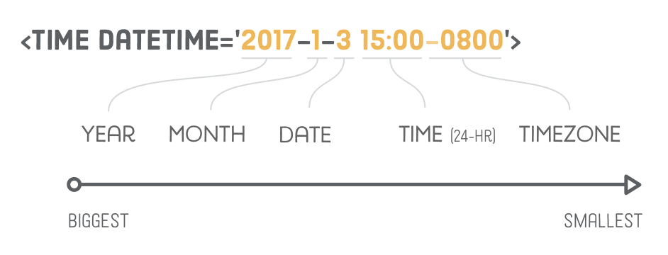

## Semantic HTML

- All your HTML markup should convey the underlying meaning of your content—not its appearance.
- There's a whole set of elements designed for the sole purpose of adding more meaning to the overall layout of  a web page. They're called `sectioning elements`, and they look something  like this:


## Articles

- The `<article>` element represents an independent article in a web page.
-  It should only wrap content that can be plucked out of your page and distributed in a completely different context.

## Section

- The `<section>` element is sort of like an `<article>`, except it doesn't need to make sense outside the context of the document. 
- Think of `<section>` as an *explicit* way to define the sections in a document outline. 
-  Often times, you need a container to wrap a section for layout purposes, and it makes sense to use the more descriptive `<section>` element over a generic `<div>`.
-  Each `<section>` element should contain at least one heading, otherwise it will add an “untitled section” to your document outline.
- use `<section>` as a more descriptive `<div>` wrapper for the implicitly defined sections of your page. 

## NAV elements

- The `<nav>` element lets you mark up the various navigation sections of your website. 
- This goes for the main site navigation, links to related pages in a sidebar, tables of content, and any group of links. 


## Header

- The `<header>` element is a new piece of semantic markup, not to be confused with head*ings* (the `<h1>`-`<h6>` elements). 
- It denotes introductory content for a section, article, or entire web page. “Introductory content”can be anything from your company's logo to navigational aids or author information.


- You can use multiple `<header>` elements to add introductory content to different parts of a document. 
- The title, author, and publication date of an `<article>` is a  good candidate for a `<header>`

## Footers

- Conceptually, footers are basically the same as headers, except they generally come at end of an article/website opposed to the beginning. 
- Common use cases include things like copyright notices, footer navigation, and author bios at the end of blog posts.

## Asides

- Headers and footers are ways to add extra information to an article, but sometimes we want to *remove* information from an article.
- For example, a sponsored blog post might contain an advertisement about the sponsoring company; however, we probably don't want to make it part of the article text. This is what the `<aside>` element is for.


- Even though the image is inside the `<article>` element, machine readers know that it's only tangentially related to the article content.
-  In addition to advertisements, `<aside>` is also appropriate for highlighting definitions, stats, or quotations. 
- If it looks different than the rest of the article, chances are it's an aside.

## Dates & Time

- The `<time>` element represents either a time of day or a calendar date. 
- The machine-readable date is defined in the `datetime` attribute. An easy way to remember the date format is that it goes from largest time period to smallest: year, month, then date.

```html
<time datetime='2017-1-3 15:00-0800'>January 3rd</time>
```

- The time itself is in 24-hour format, and the `-0800` is the time zone offset from GMT (in this case, `-0800` represents Pacific Standard Time).



## Address

- The `<address>` element is like `<time>` in that it doesn't deal with the overall structure of a document, but rather embellishes the parent `<article>` or `<body>` element with some metadata.
- It defines contact information for the author of the article or web page in question. `<address>` should *not* be used for arbitrary physical addresses.

```html
<address>
    Please contact <a href='mailto:troymcclure@example.com'>Troy
    McClure</a> for questions about this article.
</address>
```


## Figures & Caption

- Used to add visible descriptions to the `` elements in an article.

```html
<figure>
    , <section>, and <nav> elements'/>
    <figcaption>New HTML5 semantic elements</figcaption>
</figure>
```

- The `alt` attribute is closely related to the `<figcaption>` element. `alt` should serve as a text *replacement* for the image, while `<figcaption>` is a supporting *description* displayed with either the image or its text-based equivalent.
- When using `<figcaption>` in the above manner, you can safely omit an image's `alt` attribute without hurting your SEO.